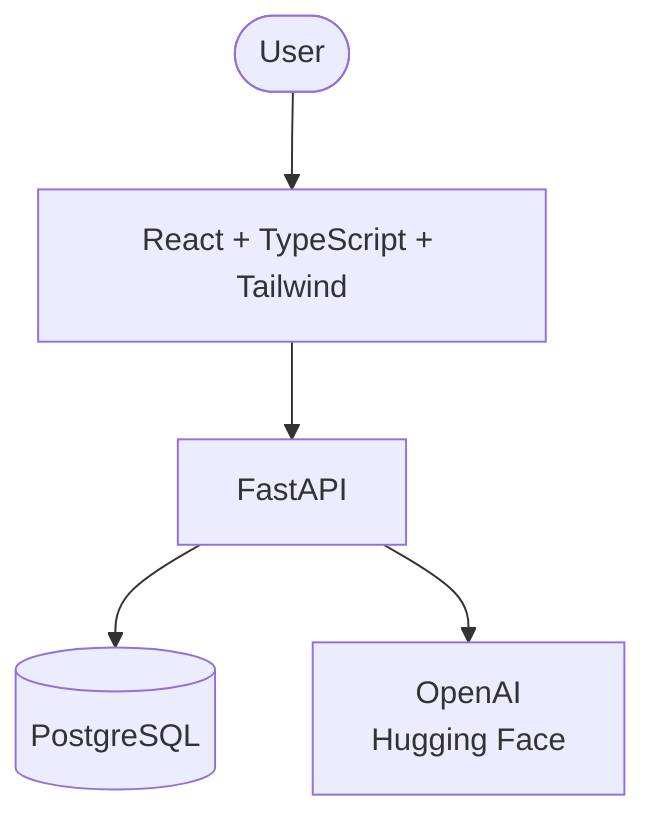

# LuminForge Architecture

## Overview

LuminForge is an open-source platform designed to help aspiring AI Engineers organize their learning journey, build projects, track progress, and prepare for careers in Artificial Intelligence.

---

# System Architecture:

## Frontend

The frontend will be responsible for the user interface and user experience.

Technology:

- React
- TypeScript
- Vite
- Tailwind CSS

Responsibilities:

- User interface
- Dashboard
- Progress tracking
- Project management
- Data visualization

---

## Backend

The backend will provide the application logic and APIs.

Technology:

- FastAPI
- Python
- PostgreSQL
- SQLAlchemy

Responsibilities:

- User management
- Data processing
- Authentication
- API services

---

## AI Layer

The AI layer will provide intelligent features.

Technology:

- OpenAI API
- Hugging Face
- LangChain

Responsibilities:

- AI Mentor
- Learning recommendations
- Interview simulation
- Project assistance

---

# Future Architecture:

text
User

↓

React Frontend

↓

FastAPI Backend

↓

PostgreSQL Database

↓

AI Services

(OpenAI / Hugging Face)

---
## Architecture Diagram

---

## Architecture Principles:

- Separation of Concerns

- Single Responsibility

- Component-Based Design

- API First

- Documentation First

- Scalability

---

## Non-Functional Requirements

- Responsive Design
- Accessibility
- Clean Code
- Scalability
- Performance
- Security
- Maintainability

